# Proyecto Sprint #1 | Track UX _Laboratoria_

## Reto
**Entender y optimizar el journey de tomar un camión de CDMX <> Cuernavaca**, con el objetivo de conocer el _proceso de diseño_ de una solución tecnológica.

Para ello se requiere la conformación de equipos de al menos 3 personas que cubran los roles de: Dueño de producto (Product Owner), UX Designer y UX Researcher.

## Viaja Seguro 360

### Equipo

PO - Ana Laura Sánchez  
UX Research - Samahara Fernanández y Nancy Santana  
UX Design - Rosa Talía Colunga Tello

### Empatizar

Para ser capaces de optimizar la experiencia de los usuarios ante los diferentes productos y servicios, es necesario entenderlos y ponerse en su lugar. Para ello se realiza una aproximación a sus intereses y necesidades analizando las siguientes variables dentro del _empathy map_:

- Qué ve
- Qué dice y hace
- Qué oye
- Qué piensa y siente

Dicho análisis nos permite identificar el problema a resolver, las características del usuario, _pain-points_ y qué beneficios que espera obtener.

**Enunciado del problema**

Definir una alternativa para aquellos usuarios que tienen complicaciones al buscar un método de **traslado seguro desde su punto de partida hasta la terminal, y de la terminal a su destino**, esto en conjunto con _partners locales_ que nos ayudarán en el proceso de traslado de nuestro usuario, de manera eficiente, segura y cómoda.

**Características de usuario**

- Adulto-joven
- Usuario recurrente de tecnología
- Utiliza tarjeta de crédito
- Vive en área metropolitana
+ *+ $6,000MN* mensual
- No es viajero frecuente
- Viaja por placer
- Viaja acompañado
- Vive solo
- Es organizado

_**Pain-point:** Seguridad._  
_**Qué beneficios que espera obtener:** Viajar seguro, de forma fácil y cómoda._

### Investigar

Con el objetivo de verificar las hipótesis generadas a través del mapa de empatía. Se comienza a realizar un conocimiento más profundo y certero con el usuario por medio de una **encuesta**.

Se eligió como herramienta *Google Forms*, y se plantearon un total de 25 preguntas entre las cuales se eligieron las 10 más relevantes para el proceso de investigación.

**Insights**

Enlace a la hója de cálculo con los resultados: https://goo.gl/uGT26S

La encuesta se cerró con 67 respuestas:
- Una de las mayores preocupaciones de los usuarios que viajan a otro estado es la seguridad (en su mayoría mujeres prefieren seguridad sobre precio).
- El 49.3% de los usuarios utilizan servicios como Taxi o Uber para trasladarse de su casa a la terminal de autobuses.
- El 66.7% de los usuarios utilizan servicios como Taxi o Uber trasladarse de la terminal a su destino.
- El 48% de los encuestados utilizan uber porque es más seguro y práctico de utilizar.
- El taxi fuera de la terminal obtuvo media de 5 debajo de servicios como Uber o transporte privado de la línea.
- El 74.6% de los encuestados ha realizado compras por Internet y 44.7% lo hace de manera regular.
- A 73.1% (49 personas) de nuestros encuestados, les resultaría cómodo resolver su transporte hacia la terminal y posteriormente a su destino, en una misma compra. A 22.4% (15 personas) les resultaría cómodo.

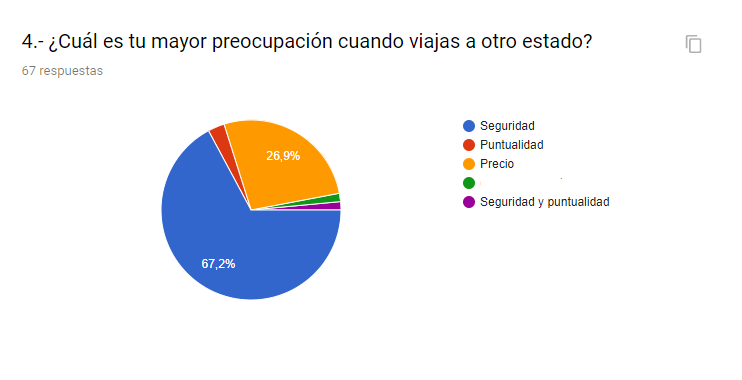

### Definir

Para comenzar la definición de la marca es importante definir _¿Qué tipo de producto tengo?_ así como _¿Qué hay afuera y qué está haciendo la competencia?_

**Dónde va a vivir el proyecto**

Dado que el proyecto funciona por medio de alianzas con partners locales, se plantea como un servicio adquirible dentro del mismo proceso de compra de boletos de autobús a través de internet.
Físicamente sería visible mediante un banner en el sitio web y estaría disponible opcionalmente dentro del formulario de compra.

**Análisis de competencia**

Conocer aquello que hace la competencia y que sí le está funcionando así como aquello que no, nos ayuda a enfocarnos en nuestra propuesta para potenciar lo que nos diferenciará.

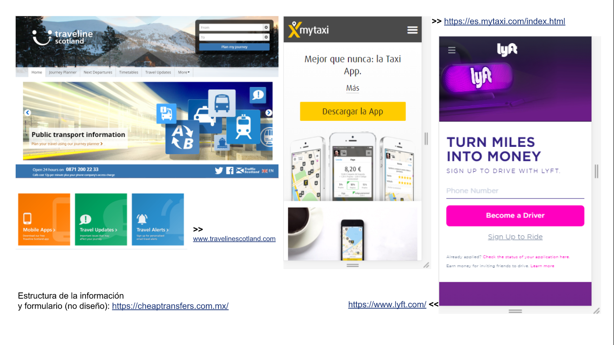
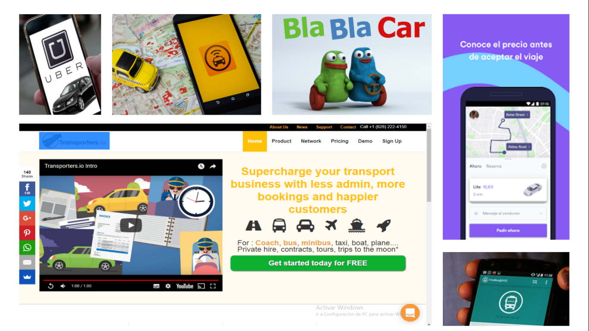

### Idear

**Diseño centrado en el Usuario**

Dentro de la planeación estratégica centrada en las necesidades de seguridad y comodiad al transportarse, de nuestro usuario podemos identificar lo siguiente:

###### **Usuario**

**Necesidades**: Transporte de punto de partida hacia la terminal y de la terminal al destino.

**Acciones**: Son la serie de pasos que realiza el usuario desde que accede a la plataforma para adquirir sus boletos, busca el día y hora de su interés, _interactúa con el banner promocional_, elige su(s) asientos, _elige punto de partida y destino final con nuestro servicio_, llena sus datos y finalmente realiza su pago.

###### **Organización**

**Objetivos**: Incrementar ventas y usuarios.

**Métricas**: Número de registros completados en formularios, número de recompras.

###### **Propósito**

Incrementar ventas y atraer usuarios resolviendo la necesidad de transporte hacia y desde la terminal.

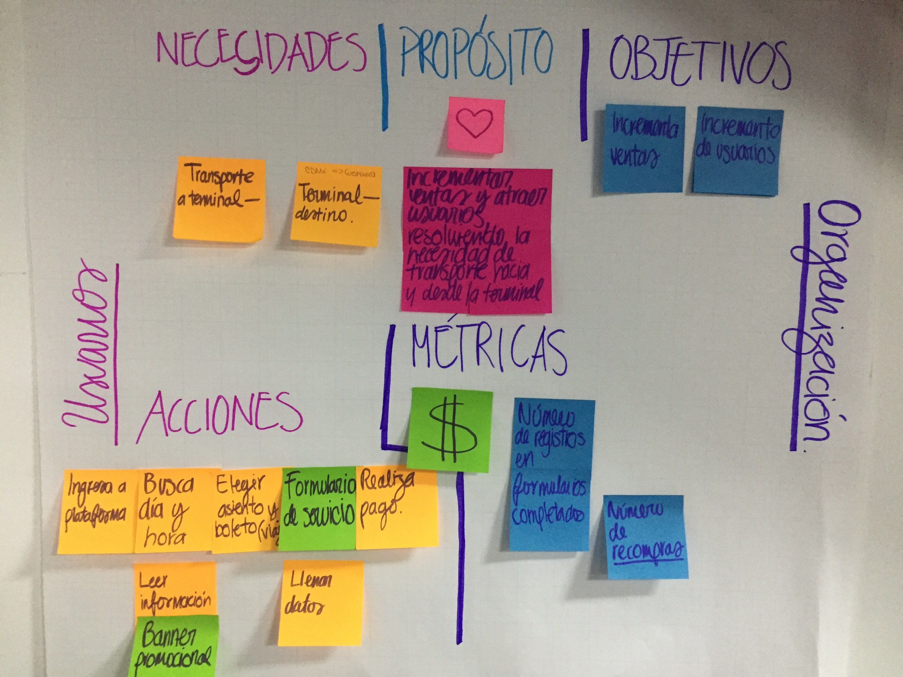

### Bocetaje

A partir de toda la información reunida a través del backlog sobre los objetivos de negocio, las necesidades y expectativas del usuario acerca del servicio, los insights de la validación y el cuadro DCU (Diseño Centrado en el Usuario), nos es requerido por el profesor realizar la planeación de una ***landing page*** que nos identifique como "empresa" y que nos permita medir el interés real de las personas.

Para ello, se realizó un _primer boceto_ tomando en cuenta las observaciones de todo el equipo de trabajo, donde se consideraron los aspectos principales que se querían comunicar acerca del servicio.

Posteriormente, se realizó un segundo boceto donde se propusó con mayor claridad el tipo de gráficos que serían útiles para ilustrar el servicio así como la ubicación de los call to action y formulario.

Una vez realizada una primera versión del sitio tomando en consideración los comentarios del equipo, se sintetizó en mayor medida y se procedió a generar los encabezados y un _tercer boceto_ que contenía de forma más organizada la propuesta

### Landing Page V1.0

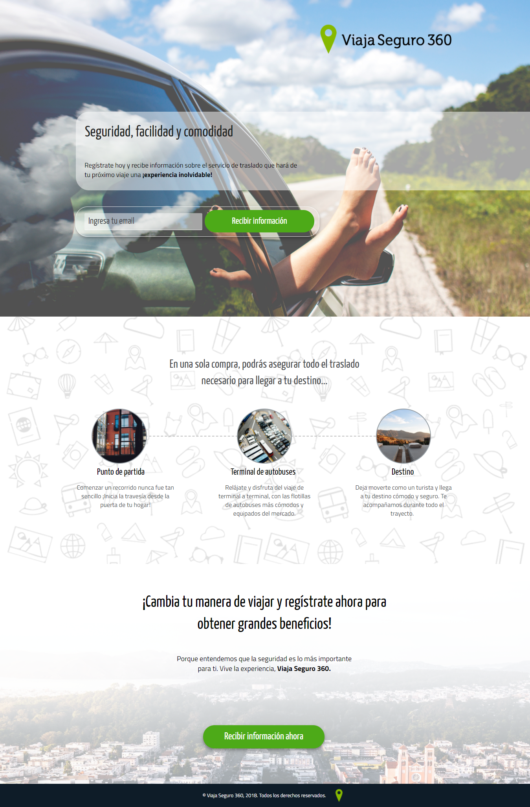

  **Mobile**

  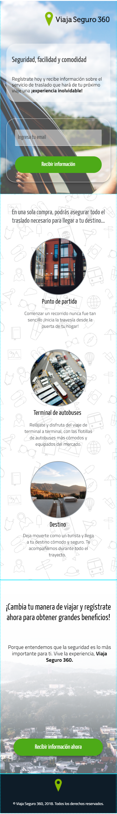

**Analytics**

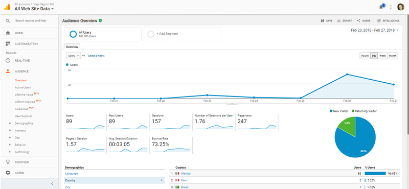

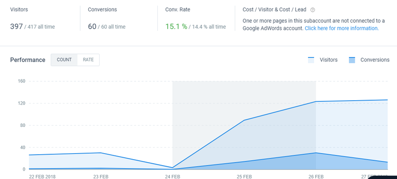

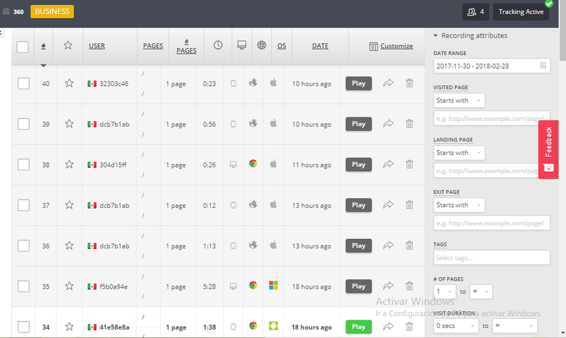

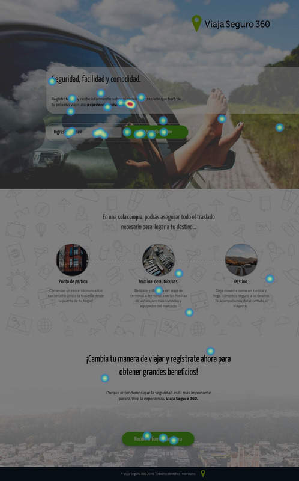

### Landing Page V2.0

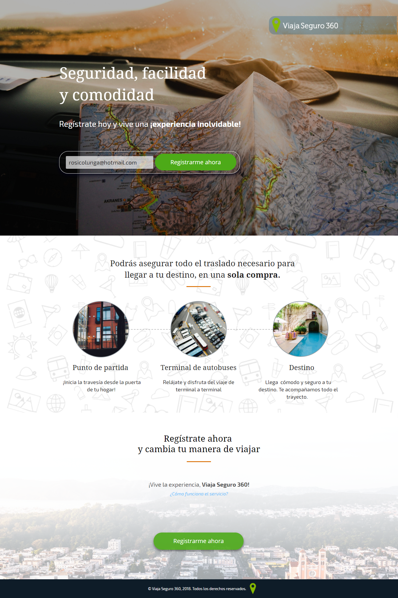

  **Mobile**

  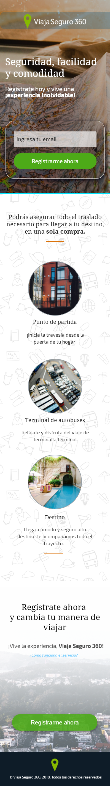
